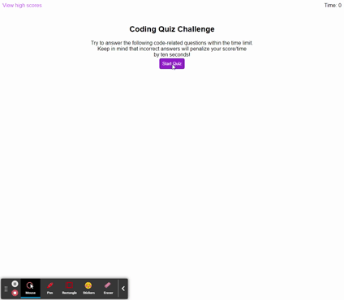

# Code-quiz

Code Quiz is a quiz that demonstrates using JavaScript code to use Web APIs. It features questions asked in a random order, a timer/score that counts down from 75 and uses local storage to maintain high scores.

## Screen shot

## Live Link
[Code Quiz](https://tbellenger.github.io/code-quiz/)